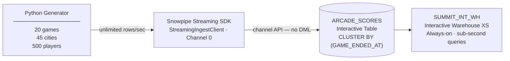

# Summit 2026 Interactive Lab
## Real-Time Arcade Score Streaming with Snowpipe Streaming + Interactive Tables

Stream thousands of arcade game scores from across the globe into Snowflake in real time, materialise them into an **Interactive Table**, and query with an **Interactive Warehouse** — experiencing sub-second latency at scale.

---

## Architecture



Snowpipe Streaming uses the **channel API**, not SQL DML, so it writes rows directly into the Interactive Table — no intermediate landing table needed.

### Warehouse design

| Warehouse | Type | Purpose |
|---|---|---|
| `SUMMIT_TRAD_WH` | Standard XS | Comparison baseline for Exercise 10 |
| `SUMMIT_INT_WH` | **Interactive XS** | All lab queries; always-on, sub-second responses |

---

## Start here

**1. Choose your environment**

| I want to... | Go to |
|---|---|
| Use GitHub Codespaces (recommended) | [docs/01-env-codespaces.md](docs/01-env-codespaces.md) |
| Run locally with Docker + VS Code | [docs/02-env-devcontainer.md](docs/02-env-devcontainer.md) |
| Run natively on macOS / Windows / Linux | [docs/03-env-local.md](docs/03-env-local.md) |
| Compare options first | [docs/00-choose-your-environment.md](docs/00-choose-your-environment.md) |

**2. Set up Snowflake** → [docs/04-snowflake-setup.md](docs/04-snowflake-setup.md)

**3. Start the streamer** → [docs/05-start-streaming.md](docs/05-start-streaming.md)

**4. Run the lab exercises** → [docs/06-exercises.md](docs/06-exercises.md)

**Optional: JMeter concurrency test** → [docs/07-jmeter.md](docs/07-jmeter.md)

**Optional: Streamlit dashboard** → [STREAMLIT.md](STREAMLIT.md)

---

## Supported regions

Interactive Tables and Warehouses are GA in:

- **AWS:** `us-east-1`, `us-west-2`, `us-east-2`, `ca-central-1`, `ap-northeast-1`, `ap-southeast-2`, `eu-central-1`, `eu-west-1`, `eu-west-2`
- **GCP:** `us-central1`, `us-east4`, `europe-west2/3/4`, `australia-southeast2`
- **Azure:** All Azure regions

---

## Interactive Warehouse key facts

| Property | Value |
|---|---|
| Query timeout (SELECT) | 5 seconds (cannot be increased) |
| Auto-suspend | No — runs continuously |
| Cache warm-up | Required after resume (2–5 min for small tables) |
| Compatible table types | Interactive Tables only |
| Sizing guidance | XS = working set < 500 GB |
| Billing | Minimum 1 hour; per-second after that |

---

## Cleanup

Open **`sql/05_cleanup.sql`** in Snowsight and run it. Drops (in order): the Streamlit dashboard, compute pool, both warehouses, database (cascades to all tables and pipes), service user, and roles.

---

## File structure

```
Summit26-InteractiveLab/
├── README.md
├── STREAMLIT.md                     Optional Streamlit dashboard setup
├── requirements.txt                 Snowpipe Streaming SDK dep
├── profile.json.example
├── .gitignore
├── .devcontainer/
│   └── devcontainer.json            GitHub Codespaces / Dev Container config
├── scripts/
│   └── install_jmeter.sh            Installs JMeter 5.x + Snowflake JDBC driver
├── docs/
│   ├── 00-choose-your-environment.md
│   ├── 01-env-codespaces.md
│   ├── 02-env-devcontainer.md
│   ├── 03-env-local.md
│   ├── 04-snowflake-setup.md
│   ├── 05-start-streaming.md
│   ├── 06-exercises.md
│   └── 07-jmeter.md
├── sql/
│   ├── 01_setup.sql                 Full Snowflake provisioning
│   ├── 02_service_auth.sh           RSA key pair + network policy SQL
│   ├── 03_lab_queries.sql           11 exercises + bonus queries
│   ├── 04_generate_pat.sql          Generate PAT for Cortex CLI
│   └── 05_cleanup.sql               Teardown
├── python/
│   ├── config.py                    Game catalogue, cities, skill tiers
│   ├── generator.py                 Realistic score generator
│   └── arcade_streamer.py           Snowpipe Streaming SDK ingest
└── jmeter/
    ├── concurrency_test.jmx         JMeter test plan
    └── run_concurrency_test.sh      Test runner script
```
